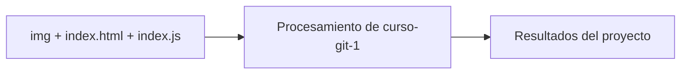

# Curso Git

## Descripción

Curso Git Mastermind

## Diagrama

[Explorar la arquitectura interactiva en GitDiagram](https://gitdiagram.com/HoracioLaphitz/curso-git-1)

## Tecnologías

- HTML
- CSS
- JavaScript
